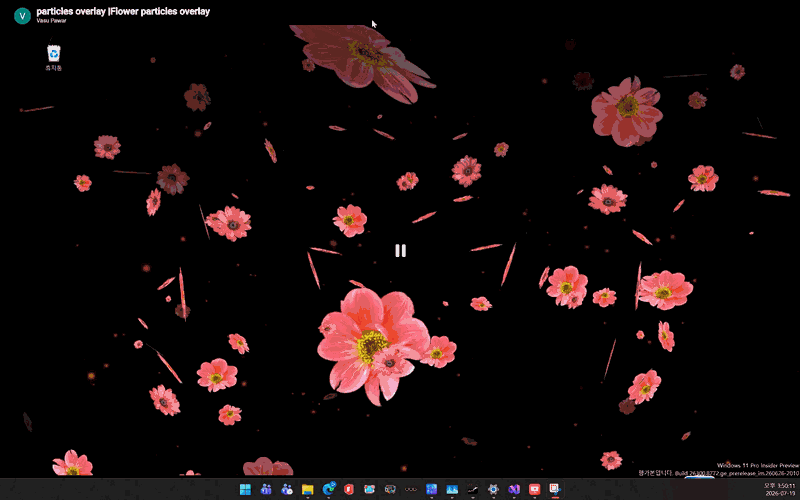
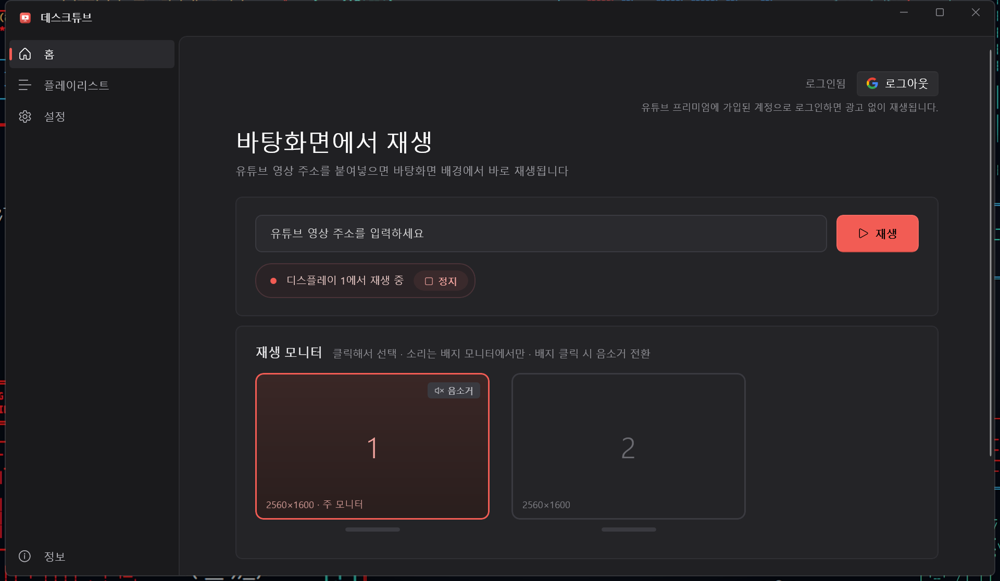
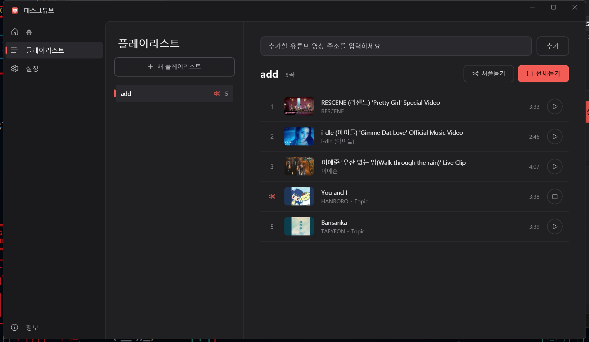
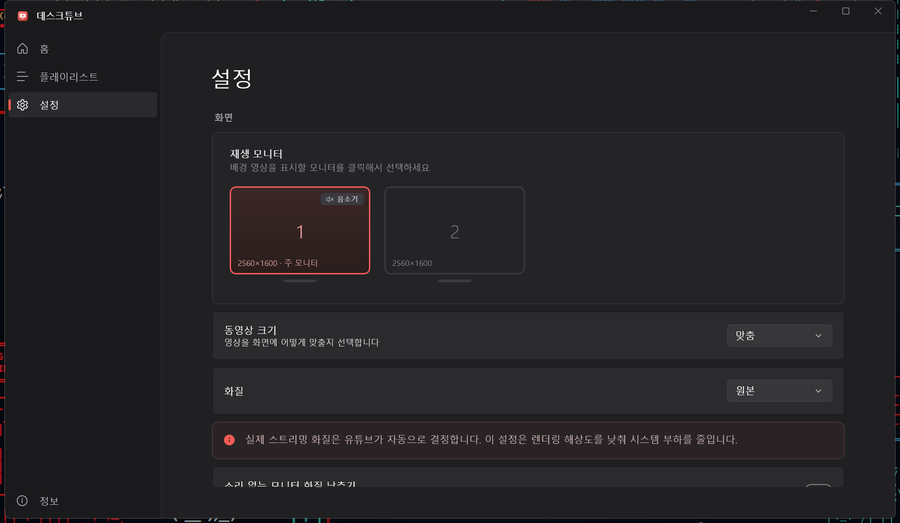
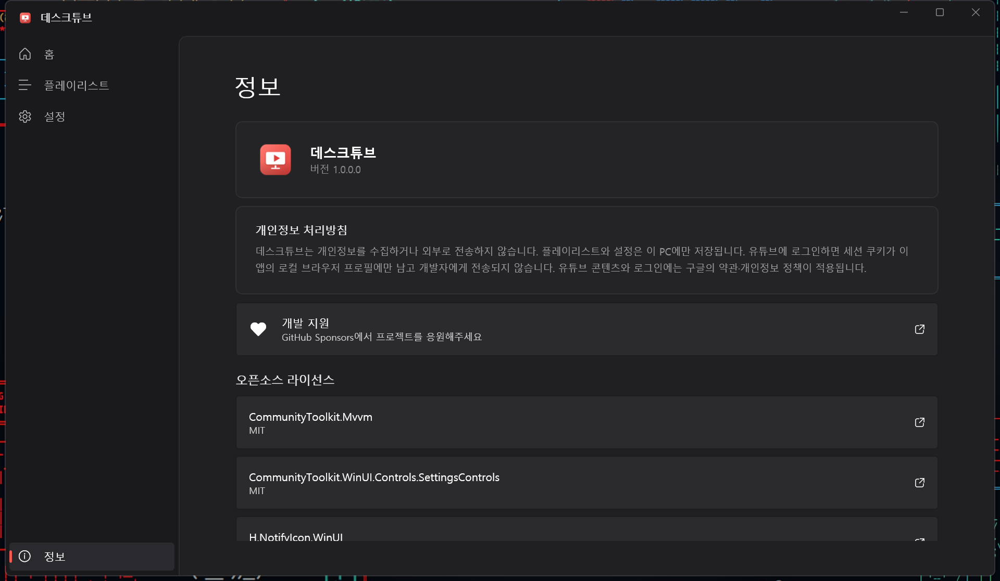
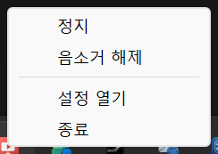

# 데스크튜브 (DeskTube)

**좋아하는 유튜브 영상을 바탕화면 배경으로.**

유튜브 영상 주소를 붙여넣으면, 바탕화면 아이콘과 작업 표시줄을 가리지 않고 배경화면 자리에서 영상이 재생되는 Windows 데스크톱 앱입니다.

---

## 이런 분께 좋아요

- 작업하는 동안 음악 라이브 영상·플레이리스트를 배경으로 틀어 두고 싶은 분
- 움직이는 배경화면(라이브 월페이퍼)을 유튜브 영상으로 꾸미고 싶은 분
- 모니터가 여러 대라서 **모든 화면에 같은 영상**을 채우고 싶은 분
- 창을 띄워 두지 않고, 트레이에서 조용히 재생만 하고 싶은 분

> 영상은 바탕화면 아이콘 **뒤**에서 재생됩니다. 아이콘·폴더·작업 표시줄은 그대로 보이고, 배경화면만 영상으로 바뀐 것처럼 동작합니다.

---

## 지원 환경

| 항목 | 내용 |
|---|---|
| 운영체제 | Windows 11 |
| 설치 방식 | Microsoft Store |
| 지원 언어 | 한국어 · English |

개발에 사용한 기술 (개발자용 참고)

- **UI 프레임워크**: WinUI 3 (Windows App SDK)
- **언어 / 런타임**: C# / .NET
- **영상 재생**: WebView2 + 유튜브 IFrame Player
- **데이터 저장**: 로컬 PC의 JSON 파일 (외부 서버로 전송하지 않음)

---

## 처음 시작하기

1. **앱을 실행합니다.** 메인 창(홈 화면)이 열리고, 작업 표시줄 오른쪽 끝(시계 옆)의 **시스템 트레이**에 데스크튜브 아이콘이 상주합니다.
2. 홈 화면의 입력란에 **유튜브 영상 주소**를 붙여넣고 **재생** 버튼을 누릅니다. (watch / youtu.be / shorts / live 주소 모두 지원)
3. 바탕화면 배경에서 영상이 재생됩니다. **창을 닫아도 재생은 계속됩니다** — 앱은 트레이에서 계속 동작합니다.
4. 자주 듣는 영상은 [플레이리스트](#-플레이리스트-화면)에 담아 두면 셔플·반복으로 이어서 들을 수 있습니다.

> 💡 **Windows 시작 시 자동 실행**이 기본으로 켜져 있습니다. PC를 켜면 창 없이 트레이로 조용히 시작해, 마지막으로 재생하던 항목을 이어서 재생합니다. ([설정](#️-설정-화면)에서 끌 수 있습니다.)

---

## 기본 동작 한눈에 보기

- **재생을 시작하는 방법은 4가지입니다.**
  1. 홈 화면에 **영상 주소를 붙여넣고 재생** — 그 영상 하나를 바로 재생
  2. 홈 화면의 **빠른 재생** — 플레이리스트 칩을 눌러 바로 재생
  3. 플레이리스트 화면의 **셔플듣기 / 전체듣기 / 이 곡부터 듣기**
  4. 트레이 아이콘 오른쪽 클릭 → **재생** — 마지막으로 재생하던 항목부터 재개
- **정지하는 방법도 여러 가지입니다.** 홈 화면의 **정지** 버튼, 재생을 시작한 듣기 버튼(정지 버튼으로 바뀜), 트레이 메뉴의 **정지** 중 아무거나 누르면 배경 영상이 사라지고 원래 배경화면으로 돌아갑니다.
- **플레이리스트는 끝나도 멈추지 않습니다.** 마지막 곡이 끝나면 처음부터 다시 반복합니다. (셔플듣기로 시작했으면 셔플 순서로, 전체듣기로 시작했으면 목록 순서로 반복)
- **소리는 한 모니터에서만 납니다.** 여러 모니터에서 재생해도 소리는 지정한 1개 모니터에서만 나오고, 나머지는 화면만 동기화됩니다.
- **재생할 수 없는 영상은 알아서 건너뜁니다.** 삭제되었거나 비공개이거나 외부 재생이 금지된 영상은 자동으로 다음 곡으로 넘어갑니다.
- **앱은 한 번에 하나만 실행됩니다.** 앱이 이미 떠 있을 때(트레이에만 있어도) 바로가기를 다시 눌러도 앱이 두 개 생기지 않고, 실행 중인 앱의 메인 창이 열립니다. 재생 중이던 영상에는 영향이 없습니다.

---

## 화면별 안내

데스크튜브의 메인 창은 왼쪽에 메뉴(사이드바)가 있고, 메뉴를 누르면 오른쪽에 해당 화면이 나타납니다.

- 🏠 **홈** — 주소 입력 즉시 재생, 재생 모니터 선택, 빠른 재생
- 🎵 **플레이리스트** — 재생 목록 만들기·듣기
- ℹ️ **정보** — 버전·개인정보·라이선스
- ⚙️ **설정** — 화면·소리·자동 실행 등 (사이드바 맨 아래)

---

### 🏠 홈 화면

앱을 열면 가장 먼저 보이는 화면으로, **주소를 붙여넣어 바로 재생**하는 곳입니다.

- **주소 입력란** — 유튜브 영상 주소를 붙여넣고 **재생**을 누르면 바탕화면에서 재생됩니다. 마지막에 입력한 주소는 저장되어 다음 실행 때도 그대로 남아 있습니다.
- **재생 / 정지 버튼** — 입력한 영상을 재생하거나, 지금 재생 중인 배경 영상을 정지합니다.
- **로그인 상태**(오른쪽 위) — 유튜브 로그인 여부("로그인됨 / 로그인 안 됨")와 로그인·로그아웃 버튼이 있습니다. 유튜브 프리미엄에 가입된 계정으로 로그인하면 광고 없이 재생됩니다.
- **재생 모니터** — 연결된 모니터가 카드로 표시됩니다. 클릭해서 영상을 표시할 모니터를 고르세요(여러 개 선택 가능). 소리가 나는 모니터에는 **소리 배지**가 붙어 있고, 배지를 클릭하면 음소거를 켜고 끌 수 있습니다. (소리 배지는 코럴색 = 소리 켬, 회색 = 음소거)
- **빠른 재생** — 만들어 둔 플레이리스트가 칩으로 나열됩니다. 클릭 한 번으로 그 리스트를 바로 재생합니다. 지금 재생 중인 리스트에는 스피커 아이콘이 표시됩니다.

---

### 🎵 플레이리스트 화면

**자주 듣는 영상을 목록으로 관리**하는 화면입니다. 왼쪽이 플레이리스트 목록, 오른쪽이 선택한 리스트의 곡 목록입니다.

**플레이리스트 목록 (왼쪽)**

- **새 플레이리스트** 버튼으로 리스트를 만듭니다. (최대 100개)
- 리스트를 **오른쪽 클릭**하면 **이름 변경 · 삭제**를 할 수 있습니다.
- 지금 재생 중인 리스트에는 스피커 아이콘이 표시됩니다.

**곡 목록 (오른쪽)**

- 아래 입력란에 유튜브 영상 주소를 붙여넣고 **추가**를 누르면 목록에 담깁니다. (리스트당 최대 1,000개)
- 각 곡은 **순위 · 썸네일 · 제목 · 채널명 · 재생시간**이 함께 표시됩니다. 제목과 채널명은 자동으로 조회되고, 재생시간은 그 곡을 실제로 재생하면 채워집니다(아직 재생하지 않은 곡은 공란).
- **셔플듣기 / 전체듣기** — 리스트 전체를 무작위 또는 순서대로 재생합니다. 재생 중에는 버튼이 정지 버튼으로 바뀌어, 다시 누르면 바로 멈춥니다.
- 곡 위에 마우스를 올리면 나오는 **재생 버튼**으로 그 곡부터 순서대로 들을 수 있습니다.
- 곡을 **드래그**하거나 **오른쪽 클릭 → 위로 이동 / 아래로 이동**으로 순서를 바꾸고, **삭제**로 목록에서 뺄 수 있습니다.
- **오른쪽 클릭 → 공유** — 영상 주소를 확인하고 클립보드로 복사할 수 있습니다.
- 지금 재생 중인 곡은 순위 자리에 스피커 아이콘이 표시되고, 곡이 바뀌면 표시도 따라 이동합니다.
- 재생 중에 곡을 추가·삭제해도 바로 반영됩니다.

---

### ⚙️ 설정 화면

사이드바 맨 아래 **설정**에서 앱 전체의 동작을 관리합니다.

**화면**

- **재생 모니터** — 배경 영상을 표시할 모니터를 클릭해서 고릅니다. (홈 화면과 같은 기능)
- **동영상 크기** — 영상을 화면에 맞추는 방식입니다.
  - **채움** — 화면을 꽉 채우고 넘치는 부분은 잘라냅니다.
  - **맞춤**(기본) — 영상 비율을 유지합니다. 위아래 또는 좌우에 여백이 생길 수 있습니다.
  - **늘리기** — 비율을 무시하고 화면에 꽉 차게 늘립니다.
- **화질** — 원본 / 1080p / 720p / 480p. 낮출수록 컴퓨터 부담이 줄어듭니다. (실제 스트리밍 화질은 유튜브가 자동으로 결정하며, 이 설정은 렌더링 해상도를 제한합니다.)
- **소리 없는 모니터 화질 낮추기**(기본 켬) — 여러 모니터로 재생할 때, 소리가 나지 않는 모니터의 화질을 낮춰 부담을 줄입니다.
- **자막** — 켜면 영상에 자막을 표시합니다. (자막이 제공되는 영상만, 기본 끔)

**소리**

- **소리 나오는 모니터** — 소리를 낼 모니터를 고릅니다. "자동 (주 모니터)"이 기본입니다.
- **볼륨** — 재생 볼륨을 조절합니다.
- **음소거** — 켜면 모든 모니터의 소리를 끕니다. (홈 화면의 소리 배지, 트레이의 음소거와 연동)

**일반**

- **Windows 시작 시 자동 실행**(기본 켬) — PC에 로그인하면 창 없이 트레이에서 마지막 설정으로 재생을 시작합니다.
- **앱 시작 후 자동 재생**(기본 켬) — 앱을 열면 마지막으로 재생하던 항목을 이어서 재생합니다.
- **언어** — 시스템 언어 / 한국어 / English. 바꾸면 앱이 다시 시작됩니다.
- **유튜브 계정** — 로그인하면 유튜브 프리미엄 혜택(광고 없음)이 배경 재생에도 적용됩니다. 로그인 버튼을 누르면 구글 로그인 창이 열리고, 로그인이 끝나면 자동으로 닫힙니다.
- **자동 일시정지** — 아래 상황에서 배경 영상을 잠시 멈춰 시스템 자원을 아낍니다. 상황이 끝나면 자동으로 다시 재생됩니다.
  - **전체 화면 앱 사용 중** — 게임·발표 등 전체 화면 앱을 쓰는 동안
  - **배터리 절약 모드일 때**
  - **화면이 잠겨 있을 때**

---

### ℹ️ 정보 화면

- 앱 아이콘·이름·**버전**
- **개인정보 처리방침** — 데스크튜브는 개인정보를 수집하거나 외부로 전송하지 않습니다.
- **개발 지원** — GitHub Sponsors에서 프로젝트를 응원할 수 있습니다.
- 앱이 사용하는 **오픈소스 라이선스** 목록 (항목을 클릭하면 해당 프로젝트 사이트로 이동)

---

### 🔔 트레이 아이콘과 메뉴

데스크튜브는 작업 표시줄 오른쪽 끝(시계 옆) **트레이**에 항상 떠 있습니다.

- **아이콘 더블클릭** — 설정 창을 엽니다.
- **아이콘 오른쪽 클릭** — 메뉴가 나옵니다.
  - **재생 / 정지** — 배경 재생을 시작(마지막 항목부터 재개)하거나 멈춥니다.
  - **음소거 / 음소거 해제**
  - **설정 열기**
  - **종료** — 앱을 완전히 끕니다.

> 메인 창의 닫기(X)는 앱을 끄지 않고 트레이로 보냅니다. 완전히 종료하려면 트레이 메뉴의 **종료**를 사용하세요.

---

## 자주 묻는 질문

**Q. 창을 닫으면 재생이 멈추나요?**
아니요. 창을 닫아도 앱은 트레이에서 계속 동작하고 재생도 이어집니다. 완전히 끄려면 트레이 메뉴의 **종료**를 누르세요.

**Q. 광고 없이 재생할 수 있나요?**
유튜브 프리미엄에 가입된 구글 계정으로 로그인하면 프리미엄 혜택이 배경 재생에도 적용되어 광고 없이 재생됩니다. 홈 화면 오른쪽 위 또는 설정의 **유튜브 계정**에서 로그인하세요.

**Q. 게임을 하는 동안에는 영상을 멈추고 싶어요.**
설정의 **자동 일시정지 → 전체 화면 앱 사용 중**을 켜 두세요. 전체 화면 앱을 쓰는 동안 자동으로 멈추고, 끝나면 다시 재생됩니다.

**Q. 어떤 영상이 재생되지 않아요.**
삭제되었거나 비공개이거나, 업로더가 외부 사이트 재생을 막아 둔 영상은 재생할 수 없습니다. 플레이리스트 재생 중에는 이런 영상을 자동으로 건너뛰고 다음 곡으로 넘어갑니다.

**Q. 컴퓨터가 무거워진 것 같아요.**
설정에서 **화질**을 720p 이하로 낮추고, **소리 없는 모니터 화질 낮추기**와 **자동 일시정지** 3종을 켜 두세요. 재생을 정지하면 사용하던 메모리도 자동으로 반환됩니다.

**Q. 플레이리스트의 재생시간이 비어 있어요.**
재생시간은 그 곡을 실제로 재생할 때 수집됩니다. 아직 한 번도 재생하지 않은 곡은 공란으로 표시되며, 재생해 보면 채워집니다.

**Q. 내 데이터가 어디로 전송되나요?**
어디에도 전송되지 않습니다. 플레이리스트와 설정은 내 PC에만 저장됩니다. 유튜브 로그인 정보(세션 쿠키)도 이 앱의 로컬 브라우저 프로필에만 남고 개발자에게 전송되지 않습니다.

---

## 개인정보 및 데이터

데스크튜브는 **개인정보를 수집하거나 외부로 전송하지 않습니다.** 플레이리스트와 설정은 모두 사용자의 PC 안에만 저장됩니다. 유튜브 콘텐츠와 로그인에는 구글(YouTube)의 약관·개인정보 정책이 적용됩니다.
